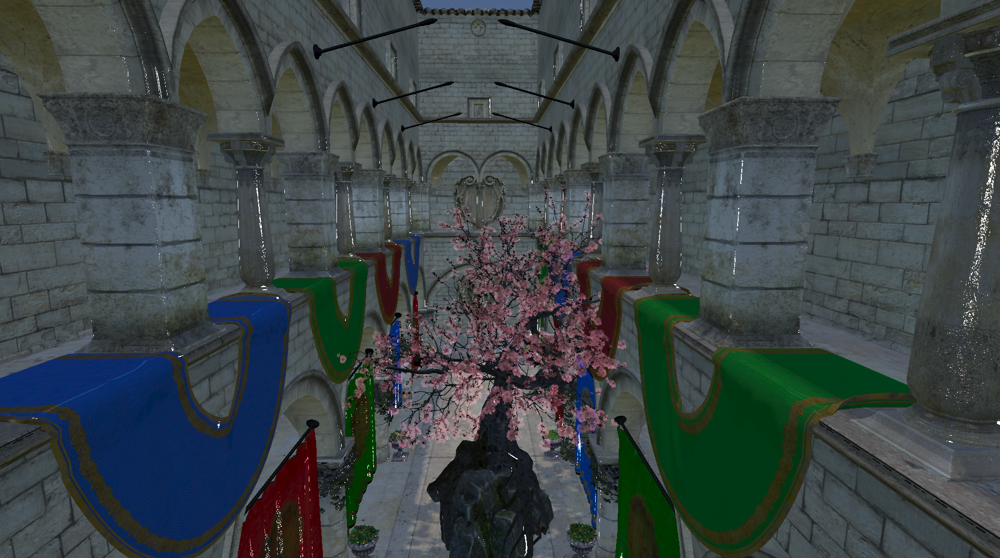

# SH Rendering Engine

## 1. RHI 구조 설계
- 현재 **Vulkan backend**만 구현됨
- **TODO**: DirectX 12 backend

## 2. Vulkan
- **Dynamic Rendering**
- **Bindless Resource**

## 3. 렌더링 Feature
- **Deferred Rendering**
- **Cascade Shadow Map**
- **PBR + IBL**
- **Translucent Rendering**
- **OIT**
- **Mesh shading**

## 4. Open Source Dependencies
- [Vulkan Memory Allocator (VMA)](https://github.com/GPUOpen-LibrariesAndSDKs/VulkanMemoryAllocator)
- [cgltf](https://github.com/jkuhlmann/cgltf)
- [glm](https://github.com/g-truc/glm)
- [stb](https://github.com/nothings/stb)
- [volk](https://github.com/zeux/volk)
- [mikktspace](https://github.com/mmikk/MikkTSpace)
